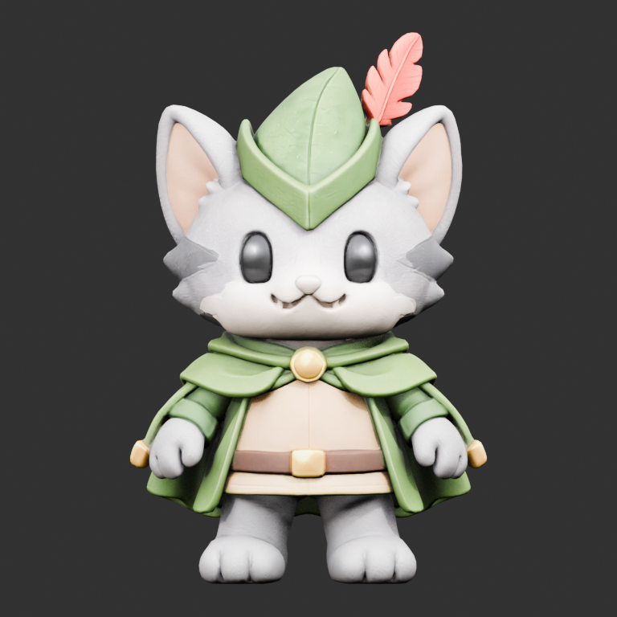
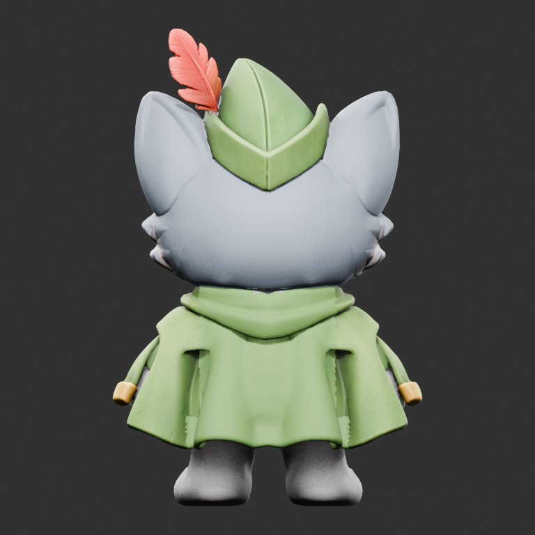
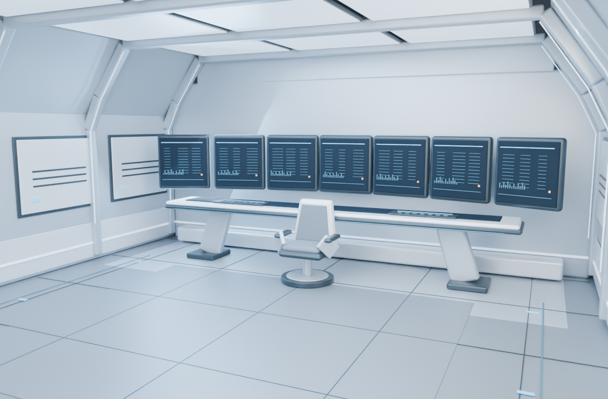

# Robin — Signal Lost

A playable Three.js micro-adventure by **lio88 Archangel9**.

[Open the live experience](https://galaxykingdog.github.io/robin-command-room-3d/) · [Download the latest release](https://github.com/galaxykingdog/robin-command-room-3d/releases/latest)

The command room has gone quiet. Help one small hero restore three systems and bring it back online—or choose **Watch demo** for a guided presentation you can take over at any time.

Robin moves through a real modeled room with a 13-bone skeleton, idle/walk/greeting animations, camera-relative movement, and obstacle collisions. Version 3 builds a short mission around the same approved character and environment from v2; the face, eyes, one lower belt, rig, and GLB files are unchanged.

## Play the mission

1. Select **Launch mission**. The 4.5-second camera introduction can be skipped with **Skip intro** or **Esc**; reduced-motion preferences skip it automatically.
2. Follow beacon **01** to the left console and align **Navigation**.
3. Walk around the front of the chair to beacon **02** at the right console and restore **Power**.
4. Return to beacon **03** in the center and open the **Uplink**.

When a beacon is in reach, tap its action button or press **E** once. Stay beside it while the connection charges for 1.6 seconds. Moving too far away cancels that connection, so return and activate it again. Each completed system brightens the room; restoring all three reveals the wireframe globe and earns a greeting from Robin. Choose **Play again** or **Keep exploring** afterward.

**Watch demo** follows the same movement, collision, and mission rules—not a prerecorded video. Use the joystick, movement keys, or **Take control** to continue manually. **Just explore** bypasses the mission and opens the room for free movement.

## Controls

| Action | Mobile / touch | Desktop |
| --- | --- | --- |
| Walk | Drag and hold the left joystick | WASD, arrow keys, or joystick |
| Choose speed | Move the thumb closer to or farther from the center | Joystick for analog speed |
| Look around | Drag the room outside the joystick | Drag the room |
| Zoom | Two-finger pinch | Mouse wheel |
| Connect to a nearby beacon | Tap the objective action | Click the action or press **E** |
| Skip the introduction | **Skip intro** | **Skip intro** or **Esc** |
| Take over the guided demo | Move the joystick or **Take control** | Movement keys or **Take control** |
| Greet | **Wave** | **Wave** |
| Pause everything / resume | **Pause / Resume** | **Pause / Resume** |
| Camera tour | **Orbit** | **Orbit** |
| Return to the entrance | **Reset** | **Reset** |
| Full screen | **Full screen**, where supported | **Full screen** |
| Optional audio cues | **Sound off / Sound on** | **Sound off / Sound on** |

Release the joystick to stop. Pointer cancellation, changing tabs, and losing focus clear held input. The joystick and camera can be used independently with separate fingers. Reduced-motion preferences stop passive idle motion; deliberate movement and greeting remain available.

Sound is off by default. Enabling it adds short synthesized interface notes, not a music track; the experience does not use the microphone or download audio files. Pause freezes mission charging and movement as well as animation.

## What changed in v3

- A cinematic opening, three ordered objectives, numbered in-world beacons, proximity guidance, and connection progress.
- A room that gradually comes back online, followed by a holographic-style wireframe globe and completion screen.
- An interruptible guided demo, manual replay, and free exploration.
- Optional synthesized audio cues, reduced-motion handling, and touch/keyboard interaction.

The foundations from v2 remain:

- The same approved single-belt character now has a real skeleton and three animation clips. The face, black eyes, front textures, and lower belt are retained.
- Rear ears and cape hem are recolored consistently, and the unwanted fused rear square is softened.
- The visible room is now real geometry: floor, shell, ceiling panels, monitor bank, desk, and chair. It is an original modeled interpretation of the supplied room reference, not an imported Marble world mesh.
- The old Marble panorama is used only for environment reflections. It is not the visible background or a fake walkable floor.
- Movement stays inside the room and slides along the desk/chair collision shapes. The camera stays on the open entrance side and maintains clearance near walls.

## Asset previews

These are studio inspection renders, not browser screenshots. Runtime lighting differs.

| Front | Rear |
| --- | --- |
|  |  |



## Run locally

Node.js **22.12 or newer** and npm are required.

```sh
npm ci
npm run check
npm run dev
```

Open the URL printed by Vite. For the production build:

```sh
npm run build
npm run preview
```

Serve the generated `dist/` directory over HTTP or HTTPS; opening the HTML directly from disk does not work. A browser with WebGL is required. No API keys or generation-service login are needed to play.

## Architecture and verification

```text
src/main.js                      Rendering, animation blending, following camera
src/input.js                     Captured-pointer joystick and keyboard input
src/movement.js                  Camera-relative motion and collision resolution
src/mission-state.js             Pure objective order, proximity, timing, transitions
src/mission-view.js              Briefing, objective, interaction, and completion UI
src/mission-effects.js           Procedural beacons and wireframe globe
src/demo-pilot.js                Deterministic guided route through the front aisle
src/sound.js                     Opt-in synthesized interface notes
public/assets/robin.glb           Rigged character with embedded textures/clips
public/assets/command-room.glb    Material-merged architectural environment
public/assets/room-layout.json    Spawn, walk bounds, and obstacle colliders
scripts/verify-assets.mjs         Binary asset, skeleton, clip, and checksum checks
scripts/test-movement.mjs         Movement, collision, release, camera-bound tests
scripts/test-mission.mjs          Objective order, charge/cancel, pause, replay tests
scripts/test-demo-pilot.mjs       Full guided route using real movement/mission rules
tools/room/build_room.py          Original architectural geometry builder
docs/ASSETS.md                    Provenance, rig specifications, and limitations
```

`npm run check` covers three areas:

- **Assets:** GLB structure, finite geometry, references, embedded images, reviewed hashes, 13 joints, three animation clips, and negative-case corruption checks.
- **Movement:** dead zones, diagonal normalization, camera-relative steering, obstacle sliding, tunneling, frame-rate tolerance, input release, and camera clearance.
- **Mission and guided demo:** ordered activation, charge cancellation, pause, finite/capped time steps, replay, reachable stations, and complete guided traversal at several frame rates without waypoint zigzag.

The unchanged rig also has Blender export/reimport and 21-sampled-pose-per-clip checks from v2. Automated checks do not replace visual browser acceptance testing. Inspect desktop, portrait, landscape, manual play, guided play, and reduced-motion behavior before publishing. No performance certification for physical phones is claimed.

Station activation requires a distance of at most 1.15 scene units. Charging lasts 1.6 seconds and requires staying within 1.35 units; paused or hidden-tab time does not advance it. These thresholds and the ordered state transitions live in `src/mission-state.js`.

## Publishing

The live site serves prebuilt files from the `gh-pages` branch. Editable source lives on `main`. After checking and building, copy **the contents** of `dist/` into a checkout of `gh-pages`, retain `.nojekyll`, and commit/push that branch. Never overwrite `main` with build output.

An optional manually triggered Actions workflow is included for accounts with Actions available. Switch Pages to **GitHub Actions** before using that alternative. It is not the active publishing route for this release. Relative paths support both root-domain and project-path hosting.

The prebuilt v3 download is `robin-command-room-web-v3.0.0.zip`. The unchanged character's editable Blender package, `robin-v2-editable-source.zip`, remains attached to [v2.0.0](https://github.com/galaxykingdog/robin-command-room-3d/releases/tag/v2.0.0). No replacement character-source ZIP is needed for v3. Both v2 and [v1.0.0](https://github.com/galaxykingdog/robin-command-room-3d/releases/tag/v1.0.0) remain available.

## Scope and rights

The character is still a generated fused mesh with conservative skinning, not animation-ready retopology. Its walk is intentionally short-stride and the wave is a modest side-paw greeting. Small sleeve deformation and a rear-cape dimple remain. There is no facial rig, finger articulation, IK, cloth simulation, jumping, or multiplayer. The room uses simple ground-plane collision shapes rather than a physics simulation.

See [asset provenance](docs/ASSETS.md) and [third-party notices](docs/THIRD_PARTY.md). No project-wide license or separate unrestricted license to the character/reference artwork is asserted by publishing this repository.
